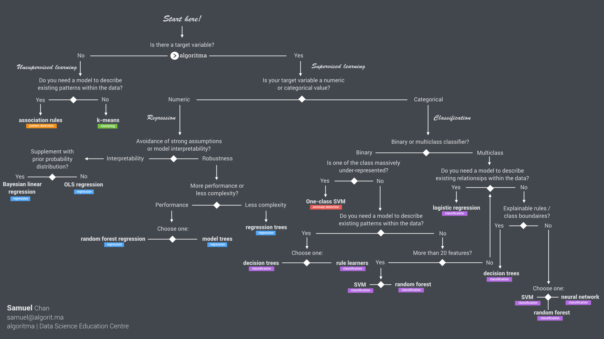

<style>
body {
text-align: justify}
</style>

# Background {.tabset}

## Libraries and Setup

```{r setup}
# chunk options
knitr::opts_chunk$set(
  message = FALSE,
  warning = FALSE,
  fig.align = "center",
  comment = "#>"
)

# scientific notation
options(scipen = 9999)
```

```{r}
# import libs
library(tidyverse)
library(lubridate)
library(GGally)
library(MLmetrics)
library(lmtest)
library(car)
library(plotly)
```


```{r out.width="100%", fig.align='center', echo=FALSE}

```


```{r out.width="100%", fig.align='center', echo=FALSE}
knitr::include_graphics("assets/RM.png")
```


Import the data to R
```{r}
copiers <- read.csv("data_input/copiers.csv") 
```

Check data structure
```{r}
glimpse(copiers)
```
profit -> Target variable

order.date -> date
ship.date -> date
sub.category -> factor
ship.mode -> factor
segment -> factor
category -> factor

Erase column:
- row.id
- order.id
- customer.id
- product.id

Check missing data
```{r}
colSums(is.na(copiers))
```


Data cleansing

```{r}
library(tidyverse) # you can also use `dplyr`
library(lubridate)

copiers.new <- copiers %>% 
  select(-c(Row.ID, Order.ID, Customer.ID, Product.ID, Category, Sub.Category)) %>% 
  mutate(Order.Date = lubridate::mdy(Order.Date),
         Ship.Date = lubridate::mdy(Ship.Date),
         Ship.Mode = as.factor(Ship.Mode),
         Segment = as.factor(Segment))


```

```{r}
copiers.new
```

## EDA

We want to know how much `Sales` influence `Profit`. Before conducting regression analysis, we have to look at the data conditions (how the relation between `Sales` and `Profit`)

We can see the relation between two variables with scatter plot
```{r}
plot(copiers.new$Sales, copiers.new$Profit)
```


Based on the plot above we know there is an outlier and we have to remove it. We also know if sales increase, profit also increase. We can confirm it by calculating the correlation
```{r}
# remove outlier
copiers.new.no_outlier <- copiers.new %>% 
  filter(Sales < 4000)

plot(copiers.new.no_outlier$Sales, copiers.new.no_outlier$Profit)

```

```{r}
# calculating the correlation
cor(copiers.new.no_outlier$Sales, copiers.new.no_outlier$Profit)
```
H0: X is not influenced by Y
H1: X is influenced by Y

when P-Value < Alpha, H0 is no option
*Commonly, Alpha = 0.05

```{r}
cor.test(copiers.new.no_outlier$Sales, copiers.new.no_outlier$Profit)
```
> P-Value < Alpha: H0 is not the option
Meaning: Sales is influenced by profit

```{r}
ggcorr(copiers.new.no_outlier, label = T)
```

**Dive Deeper**

1. Do the data preparation steps for `crime` dataset

a. Import `crime` dataset from data_input folder to R
```{r}
crime <- read.csv("data_input/crime.csv")

# renaming the column names of "crime" data
names(crime) <- c("X" ,"percent_m", "is_south", "mean_education", "police_exp60", "police_exp59", "labour_participation", "m_per1000f", "state_pop", "nonwhites_per1000", "unemploy_m24", "unemploy_m39", "gdp", "inequality", "prob_prison", "time_prison", "crime_rate")
```

The dataset was collected in 1960 and a full description of the dataset wasn't conveniently available. I use the description I gathered from the authors of the MASS package. After you rename the dataset, the variables are:  
- `percent_m`: percentage of males aged 14-24
- `is_south`: whether it is in a Southern state. 1 for Yes, 0 for No.  
- `mean_education`: mean years of schooling  
- `police_exp60`: police expenditure in 1960  
- `police_exp59`: police expenditure in 1959
- `labour_participation`: labour force participation rate  
- `m_per1000f`: number of males per 1000 females  
- `state_pop`: state population  
- `nonwhites_per1000`: number of non-whites resident per 1000 people  
- `unemploy_m24`: unemployment rate of urban males aged 14-24  
- `unemploy_m39`: unemployment rate of urban males aged 35-39  
- `gdp`: gross domestic product per head  
- `inequality`: income inequality  
- `prob_prison`: probability of imprisonment  
- `time_prison`: avg time served in prisons  
- `crime_rate`: crime rate in an unspecified category

b. Check data structure and missing data from `crime` dataset
```{r}
colSums(is.na(crime))
crime
```


c. Do data cleansing steps for `crime` dataset

- Delete unused variable in `crime` dataset
- Adjust the data types of `crime` dataset

```{r}
crime.new <- crime %>% 
  select(-c(X)) %>% 
  mutate(is_south = as.factor(is_south))
```

2. We want to know how much `gdp` influence `inequality`. Before conducting regression analysis, do the EDA steps to look at the data conditions (how the relation between `gdp` and `inequality`). You can use scatter plot or calculate the correlaion
```{r}
plot(crime.new$gdp, crime.new$inequality)

```
```{r}
ggcorr(crime.new, label = T)
```
H0: GDP 
```{r}
cor.test(crime.new$gdp, crime.new$inequality)
```

H0: GDP is NOT influenced by Inequality
H1: GDP is influenced by Inequality

> P-value < Alpha
Meaning: GDP is influenced by Inequality

# Regression Model I
## Simple Linear Regression

Before we predicting `Profit` based on `Sales`, we try to see how linear regression predicts a target if there are no predictors. We can use `lm()` function and add some parameter:

- `formula`: y ~ x
- `data`: the data used

```{r}
# model without predictor (x)
model_none = lm(formula = Profit ~ 1, data = copiers.new.no_outlier)

model_none %>% 
  summary()
```


Based on the output above we get formula:

$$y = b0$$

$$Profit = 418.41$$

```{r}
round(mean(copiers.new.no_outlier$Profit),2)
```


**Summary**

Predicting **profit** without predictor? result will be *418.41*

Bisnis problem: how much **sales** influence **profit**? Berapa profit yang diperoleh, jika diketahui sales sebesar $2?

Regression model between `Sales` and `Profit`
```{r}
model_1 = lm(formula = Profit ~ Sales, data = copiers.new.no_outlier)

model_1 %>% 
  summary()

```

## Understanding Output

1. Model regesi yang diperoleh:

$$ y = b0 + b1 x$$

$$ Profit = b0 + b1 Sales$$

b0: potongan garis y ketika x = 0
b1: slope (kemiringan)

$$Profit = -83.54810 + 0.39444 * Sales$$

```{r}
profit_1 <- -83.54810 + 0.39444*2
profit_1
```

```{r}
plot(copiers.new.no_outlier$Sales, copiers.new.no_outlier$Profit)
abline(model_1,col = "red")
```

2. Pengaruh variabel prediktor terhadap target

- H0: Sales tidak mempengaruhi Profit 
- H1: Sales mempengaruhi Profit

Tolak H0 jika p-value (peluang kesalahan) < alpha (5%). Berdasarkan output di atas diperoleh p-value (<0.0000000000000002), sehingga dapat disimpulkan bahwa Sales mempengaruhi Profit.


3. Goodness of fit

Mengukur apakah garis regresi yang dibuat sudah fit/pas menggambarkan titik observasi di seitar garis tersebut. **0 <= R-Squared <= 1**. Pada umumnya nilai R-Squared 0.7 (70%) sudah dianggap cukup, namun biasanya dihubungkan juga dengan bisnis problem yang sedang dianalisa.

dari hasil summary model, diketahui r-squared = 0.8514 (85.1%)
> Sales menggambarkan variasi profit sebesar 85.14%
> 14.86% digambarkan dengan pengaruh model lain (variabel lain)

```{r}
# Visualizing fitting line
plot(copiers.new.no_outlier$Sales, copiers.new.no_outlier$Profit)
abline(model_1,col = "red")
```

**Dive Deeper**

1. Make a linear regression model to know how much `gdp` influence `inequality`
```{r}
model_2 = lm(formula = inequality ~ gdp, data = crime.new)
```

x -> gdp
y -> inequality (tingkat kesenjangan pendapatan)


2. How the results of the model
```{r}
model_2 %>% 
  summary()
```

a. Model regesi yang diperoleh:

> Inequality: 386.03058 + (-0.36551)*GDP

b. Pengaruh variabel prediktor terhadap target

- H0: gdp tidak mempengaruhi inequality
- H1: gdp mempengaruhi inequality

> P-Value < Alpha -> Tolah H0 -> GDP mempengaruhi Inequality

c. Goodness of fit

> R-Squared = 0.7815 -> 78.15 % menggambarkan model Inequality yang diperngaruhi oleh GDP

```{r}
# Visualizing fitting line
plot(crime.new$gdp, crime.new$inequality)
abline(model_2,col="blue")
```


Reference:
- [Machine Learning Specialization opening slide](https://docs.google.com/presentation/d/1q56Tw4UHHXKLbebp8XmKuEAw21c4ZKZKTHxAyUvRObI/edit?usp=sharing)   
- [Leverage & Influence Simulation](https://seeing-theory.brown.edu/regression-analysis/index.html#section1)

