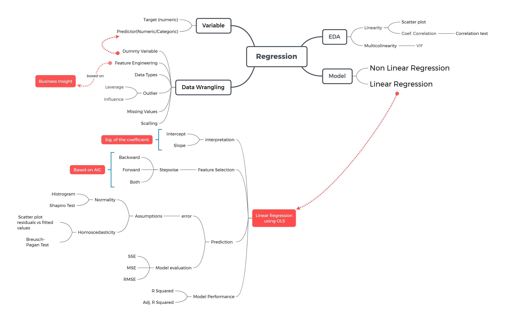

<style>
body {
text-align: justify}
</style>

# Background {.tabset}

## Libraries and Setup

```{r setup}
# chunk options
knitr::opts_chunk$set(
  message = FALSE,
  warning = FALSE,
  fig.align = "center",
  comment = "#>"
)

# scientific notation
options(scipen = 9999)
```

```{r}
# import libs
library(tidyverse)
library(lubridate)
library(GGally)
library(MLmetrics)
library(lmtest)
library(car)
library(plotly)
```


```{r out.width="100%", fig.align='center', echo=FALSE}
knitr::include_graphics("assets/cheatsheet.png")
```


```{r out.width="100%", fig.align='center', echo=FALSE}

```


Import the data to R
```{r}
copiers <- read.csv("data_input/copiers.csv") 
```

Check data structure
```{r}
glimpse(copiers)
```

Profit -> Target variabel


Check missing data
```{r}
colSums(is.na(copiers))

```


Data cleansing


order.date -> date
ship.date -> date
sub.category -> factor
ship.mode -> factor
segment -> factor
category -> factor

hapus kolom:
row.id
order.id
customer.id
product.id

```{r}
summary(copiers)
```


```{r}
library(tidyverse) # you can also use `dplyr`
library(lubridate)


copiers_new <- copiers %>% 
  select(-c(Row.ID,Order.ID,Customer.ID,Product.ID,Category,Sub.Category)) %>% 
  mutate(Order.Date = mdy(Order.Date),
         Ship.Date = mdy(Ship.Date),
         Ship.Mode = as.factor(Ship.Mode),
         Segment = as.factor(Segment))

copiers_new

```


## EDA

We want to know how much `Sales` influence `Profit`. Before conducting regression analysis, we have to look at the data conditions (how the relation between `Sales` and `Profit`)

We can see the relation between two variables with scatter plot
```{r}
plot(copiers_new$Sales,copiers_new$Profit)
```


Based on the plot above we know there is an outlier and we have to remove it. We also know if sales increase, profit also increase. We can confirm it by calculating the correlation
```{r}
# remove outlier
copiers_no_outlier <- copiers_new %>% 
  filter(Sales < 4000)
  
plot(x= copiers_no_outlier$Sales, y = copiers_no_outlier$Profit)
```

```{r}
# calculating the correlation
cor(copiers_no_outlier$Sales,copiers_no_outlier$Profit)
```

H0: X tidak berpengaruh terhadap Y
H1: X berpengaruh terhadap Y

ketika p-value < alpha, tolak h0
* umumnya alpha 0.05

```{r}
cor.test(copiers_no_outlier$Sales,copiers_no_outlier$Profit)
```

> p-value < alpha: Tolak H0
Sales berpengaruh signifikan terhadap Profit


```{r}
library(GGally)
ggcorr(copiers_no_outlier,label = T)

```


**Dive Deeper**

1. Do the data preparation steps for `crime` dataset

a. Import `crime` dataset from data_input folder to R
```{r}
crime <- read.csv("data_input/crime.csv")
crime

# renaming the column names of "crime" data
names(crime) <- c("X" ,"percent_m", "is_south", "mean_education", "police_exp60", "police_exp59", "labour_participation", "m_per1000f", "state_pop", "nonwhites_per1000", "unemploy_m24", "unemploy_m39", "gdp", "inequality", "prob_prison", "time_prison", "crime_rate")

crime
```

The dataset was collected in 1960 and a full description of the dataset wasn't conveniently available. I use the description I gathered from the authors of the MASS package. After you rename the dataset, the variables are:  
- `percent_m`: percentage of males aged 14-24
- `is_south`: whether it is in a Southern state. 1 for Yes, 0 for No.  
- `mean_education`: mean years of schooling  
- `police_exp60`: police expenditure in 1960  
- `police_exp59`: police expenditure in 1959
- `labour_participation`: labour force participation rate  
- `m_per1000f`: number of males per 1000 females  
- `state_pop`: state population  
- `nonwhites_per1000`: number of non-whites resident per 1000 people  
- `unemploy_m24`: unemployment rate of urban males aged 14-24  
- `unemploy_m39`: unemployment rate of urban males aged 35-39  
- `gdp`: gross domestic product per head  
- `inequality`: income inequality  
- `prob_prison`: probability of imprisonment  
- `time_prison`: avg time served in prisons  
- `crime_rate`: crime rate in an unspecified category

b. Check data structure and missing data from `crime` dataset
```{r}
glimpse(crime)
```


c. Do data cleansing steps for `crime` dataset

- Delete unused variable in `crime` dataset
- Adjust the data types of `crime` dataset

```{r}
crime <- crime %>% 
  select(-X) %>% 
  mutate(is_south = as.factor(is_south))

crime
```

2. We want to know how much `gdp` influence `inequality`. Before conducting regression analysis, do the EDA steps to look at the data conditions (how the relation between `gdp` and `inequality`). You can use scatter plot or calculate the correlaion
```{r}
plot(crime$gdp, crime$inequality)
```


```{r}
ggcorr(crime,label = T)
```

H0  = GDP tidak berpengaruh ke Inequality
H1 = GDP berpengaruh kepada inequelaity

```{r}
cor.test(crime$gdp,crime$inequality)
```

alpha = 0.05
> p-value < alpha
Tolak H0
GDP Berpengaruh secara signifikan terhadap inequality


# Regression Model I
## Simple Linear Regression

Before we predicting `Profit` based on `Sales`, we try to see how linear regression predicts a target if there are no predictors. We can use `lm()` function and add some parameter:

- `formula`: y ~ x
- `data`: the data used

```{r}
# model without predictor (x)
model_none <- lm(formula = Profit ~ 1, data = copiers_no_outlier)

summary(model_none)
```


Based on the output above we get formula:

$$y = b0$$

$$Profit = 418.41$$


```{r}
round(mean(copiers_no_outlier$Profit),2)
```


**Summary**

- Ketika kita ingin memprediksi profit dengan tidak ada prediktor, prediksi kita adalah *418.41* alias mean dari target variabel
- kenapa mean? karena mean dari target ariabel menghasilkan error/residual paling rendah


Bisnis problem: how much **sales** influence **profit**? Berapa profit yang diperoleh, jika diketahui sales sebesar $2?

Regression model between `Sales` and `Profit`
```{r}
model_1 <- lm(formula = Profit ~ Sales,data = copiers_no_outlier)
  
summary(model_1)
```

## Understanding Output

1. Model regesi yang diperoleh:

$$ y = b0 + b1 x$$

$$ Profit = b0 + b1 Sales$$

b0 = potongan garis y ketika x = 0
b1 = slope(kemiringan)


$$Profit = -83.54810 + 0.39444 * Sales$$

> Setiap kenaikan 1 satuan Sales, profit naik sebesar 0.39444


```{r}
profit_1 <- -83.54810 + 0.3944*2750
profit_1
```


2. Pengaruh variabel prediktor terhadap target

- H0: Sales tidak mempengaruhi Profit 
- H1: Sales mempengaruhi Profit

Tolak H0 jika p-value (peluang kesalahan) < alpha (5%). Berdasarkan output di atas diperoleh p-value (<0.0000000000000002), sehingga dapat disimpulkan bahwa Sales mempengaruhi Profit.

Berdasarkan model yang sudah dibuat, diketahui bahwa:
alpa = 0.05
> P-value dari sales < alpha
Tolak H0
Sales mempengaruhi profit secara signifikan


3. Goodness of fit

Mengukur apakah garis regresi yang dibuat sudah fit/pas menggambarkan titik observasi di seitar garis tersebut. **0 <= R-Squared <= 1**. Pada umumnya nilai R-Squared 0.7 (70%) sudah dianggap cukup, namun biasanya dihubungkan juga dengan bisnis problem yang sedang dianalisa.

Dari hasil summary model, diketahui r-squared  = 0.8514 (85.14%)
> Sales menggambarkan variasi profit sebesar 85.14%
> 14.86% yang lain dijelaskan oleh variabel lain (pengaruh diluar model)


```{r}
plot(copiers_no_outlier$Sales,copiers_no_outlier$Profit)
abline(model_1,col="red")
```

**summary**

1. Machine Learning secara umum terbagi menjadi 2 analisa"
- *Supervised Learning*: ada target variable/target prediksi (umumnya untuk memprediksi)
  - classification: target bertipe kategorikal
  - regression: target bertipe numerik
  
- *Unsupervised Learning:* tidak ada target variable (umumnya hanya untuk memahami pattern data)

2. inti dari pembuatan linear model adalah bagaimana kita menggambarkan garis linear yang mempunyai error/residual paling rendah   

3. Ketika membuat model linear tanpa menggunakan prediktor, model akan memprediksi menggunakan mean dari target variabel. kenapa mean? karena mean mempunyai angka error/residual paling rendah

4. formula linear model: y = b0 + b1*x
misal: Profit = -83.54810 + 0.39444 * Sales
artinya: setiap 1 satuan sales, menaikkan profit sebesar 0.3944 (b1)


5. goodnes of fit: seberapa baik variabel prediktor menjelaskan variansi dari variabel target. ukuran goodnes of fit dapat diketahui dari nilai r-squared
misal: r-squared: 0.8435
artinya: model yang sudah dibuat menggambarkan variansi prediktor terhadap target sebesar 84.3%. sisa 15.6% lainnya dijelaskan oleh variabel lain


--- end of day 1 ---


**Dive Deeper**


1. Make a linear regression model to know how much `gdp` influence `inequality`
```{r}

```

x -> gdp
y -> inequality (tingkat kesenjangan pendapatan)


2. How the results of the model
```{r}

```

a. Model regesi yang diperoleh:


b. Pengaruh variabel prediktor terhadap target

- H0: gdp tidak mempengaruhi inequality
- H1: gdp mempengaruhi inequality

c. Goodness of fit

R-Squared = ?

```{r}
# Visualizing fitting line

```

## Predicting New Data
If one day, we get sales amount 4797 dolar. How much the profit we get?
```{r}

```

We also can use `predict()` to get profit amount
```{r}

```

Add one column in `copiers_no_outlier` data that contain Profit prediction from simple model
```{r}

```

## Model Evaluation

Calculating error
```{r}
# error = actual - predicted

```

visit this nice [link](https://towardsdatascience.com/what-are-the-best-metrics-to-evaluate-your-regression-model-418ca481755b)

calculation MSE, RMSE, MAE manually
```{r}
# MSE (mean square error)

```

```{r}
# RMSE (root mean square error)

```


```{r}
#MAE (mean absolute error)

```


Calculate RMSE and MAE using `MLmetrics` package
```{r}
library(MLmetrics)
RMSE(y_pred = copiers_new$predicted, y_true = copiers_new$Profit)
MAE(y_pred = copiers_new$predicted, y_true = copiers_new$Profit)
```


**Dive Deeper**

1. From linear regression model (how much `gdp` influence `inequality`) you have created before, predict "inequality" value and store it in `prediction` object
```{r}

```

2. Do a model evaluation by calculate RMSE and MAE
```{r}

```


## Leverage vs Influence

**Leverage** adalah nilai yang letaknya jauh dari letak observasi-observasi lainnya, sering disebut sebagai **outlier**. Nilai leverage dapat mempengaruhi model linier regresi atau pun tidak.

- Ketika leverage mempengaruhi model linier regresi: high influence
- Ketika leverage tidak mempengaruhi model linier regresi: low influence

Nilai leverage yang menghasilkan peningkatan nilai R-squared, sebaiknya tetap dipertahankan ketika membuat model. Namun, jika nilai leverage ternyata mengakibatkan penurunan nilai R-squared, sebaiknya nilai tersebut tidak diikutsertakan ketika membuat model (dibuang).

Kita coba lihat kembali scatter plot antara `Sales` dan `Profit`
```{r}
plot(copiers$Sales, copiers$Profit)
```

Kita akan membuat model regresi linier dengan menggunakan seluruh data (termasuk outlier)
```{r}

```

Kita akan coba bandingkan model regresi linier tanpa dan dengan outlier
```{r}

```

Berdasarkan plot di atas diketahui bahwa outlier pada data copiers tidak mempengaruhi garis regresi yang dibentuk/low influence (jika dilihat garis regresi model tanpa dan dengan outlier) hampir sejajar.  Kita akan coba mengecek nilai goodness of fit nya.

Perbandingan goodness of fit model tanpa dan dengan outlier
```{r}

```


**Dive Deeper**

1. Buatlah model linier regresi dengan nilai outlier yang lebih ekstrem, yaitu dengan menambahkan nilai Sales pada observasi ke-59 dengan 3000.
```{r}

```

2. Bandingkan model linier regresi  

- Tanpa outlier `(model_no.outlier)`
- Dengan outlier `(model_outlier)`
- Dengan outlier yang lebih ekstrim `(model_outlier3000)`
```{r}

```

3. Bandingkan goodness of fit model linier regresi  

- Tanpa outlier `(model_no.outlier)`
- Dengan outlier `(model_outlier)`
- Dengan outlier yang lebih ekstrim `(model_outlier3000)`
```{r}

```


Contoh outlier (menambahkan nilai profit pada observasi ke-59 dengan nilai 3000) yang high influence
```{r}

```

Membandingkan model linier regresi  

- Tanpa outlier `(model_no.outlier)`
- Dengan outlier `(model_outlier)`
- Dengan outlier yang lebih ekstrim `(model_outlier3000)`
- Dengan outlier profit yang lebih ekstrim `(model_outlier3000.profit)`
```{r}

```

Membandingkan goodness of fit model linier regresi  

- Tanpa outlier `(model_no.outlier)`
- Dengan outlier `(model_outlier)`
- Dengan outlier yang lebih ekstrim `(model_outlier3000)`
- Dengan outlier profit yang lebih ekstrim `(model_outlier3000.profit)`
```{r}

```


# Regression Model II

## Multiple Linear Regression

y = inequality
x = all predictor

`formula = y ~ .` (menggunakan semua prediktor/x)

Regression model between `Inequality` and all predictors
```{r}
head(crime)
crime_multiple <- lm(formula = inequality ~ ., data = crime)
summary(crime_multiple)
```

1. Model regesi yang diperoleh:

$$ y = b0 + b1 * x1 + b2 * x2 + .....$$

$$ inequlity =  330.041730 - 0.383670 * percent_m + ..... $$

2. Pengaruh variabel prediktor terhadap target

- Berdasarkan nilai p-value yang diperoleh di atas dapat disimpulkan bahwa mean_education, gdp, dan crime_rate berpengaruh terhadap inequality
- **numerical variable**: est. mean_education = -1.067204. Ketika terjadi kenaikan mean_education sebesar 1 tahun, maka akan menurunkan tingkat kesenjangan pendapatan sebesar 1.067204
- **categorical variable**: est. is_south1 = 18.794908

a. is_south = 1 (berada di bagian selatan)

jika suatu negara berada di bagian selatan, maka tingkat inequality yang diperoleh sebesar b0 + 18.794908

b. is_south = 0 (tidak berada di bagian selatan)

jika suatu negara tidak berada di bagian selatan, maka tingkat inequality yang diperoleh sebesar b0 saja


"============================================="

### Dumy variable

Sebelum dilakukan linier regresi, prediktor bertipe kategorik akan ditransformasi menjadi variabel dummy. Variabel dummy yang dibentuk berjumlah banyaknya kategori dari suatu prediktor kategorik dikuraning 1 (k - 1). Contoh:
```{r}
gol_darah <- data.frame(gol.darah = c("A", "A", "O", "B", "B", "AB"))
gol_darah
```

```{r}
data.frame(gol.darahA = ifelse(gol_darah$gol.darah == "A", 1, 0),
           gol.darahB = ifelse(gol_darah$gol.darah == "B", 1, 0),
           gol.darahO = ifelse(gol_darah$gol.darah == "O", 1, 0))
```

How to interprate the result, if the category more than 2 category:

- est. gol.darahA = XXXX, nilai y ketika golongan darah nya adalah A sebesar **b0 + est. gol.darahA**
- est. gol.darahB = XXXX, nilai y ketika golongan darah nya adalah B sebesar **b0 + est. gol.darahB**
- est. gol.darahO = XXXX, nilai y ketika golongan darah nya adalah O sebesar **b0 + est. gol.darahO**
- nilai y ketika golongan darah nya adalah AB sebesar **b0 saja** (b0 + est. gol.darahA * 0 + est. gol.darahB * 0 + est. gol.darahAO * 0)

- Tingkat inequality yang diperoleh ketika faktor-faktor lain bernilai 0 adalah 330.041730


"============================================="

3. Goodness of fit

R-Squared = 0.9118, model "crime_multiple" dapat menjelaskan informasi inequlity sebesar 91.18%

Model mana yang lebih baik `model_gdpinf` atau `crime_multiple`?
```{r}
summary(model_gdpinf)
```

- R-square "model_gdpinf" = 78.15%
- R-square "crime_multiple" = 91.18%

Coba buat model linier regresi untuk memprediksi inequality berdasarkan mean_eduaction, gdp, crime_rate, dan is_south
```{r}

```

cek r-squared semua model
```{r}
summary(model_gdpinf)$r.squared # 1 prediktor
summary(crime_multiple4)$r.squared # 4 prediktor
summary(crime_multiple)$r.squared # 15 prediktor
```


cek adj r-squared semua model
```{r}
summary(model_gdpinf)$adj.r.squared # 1 prediktor
summary(crime_multiple4)$adj.r.squared # 4 prediktor
summary(crime_multiple)$adj.r.squared # 15 prediktor
```


Perbedaan R Square dan Adj R Square:

- R Square digunakan untuk melihat goodnes of fit suatu model
- Adj R Square digunakan untuk membandingkan kebaikan beberapa model

Bagaimana kriteria model linier regresi sudah dikatakan baik:
1.
2.
3.
4.

From linear regression model `crime_multiple4`, predict "inequality" value and store it in `pred_ineq` object
```{r}

```

Model evaluation (melakukan evaluasi terhadap model, bisa dengan menghitung nilai errornya)
```{r}

```


## Step-wise Regression {.tabset}

Pemilihan faktor/prediktor yang digunakan pada analisis regresi dapat dilakukan dengan:

1. Bisnis knowledge
2. Statistics tools

- Melihat nilai korelasi (numerik)
```{r}

```

- Membuat baseline model (using all predictors), kemudian pilih prediktor yang signifikan berpengaruh terhadap target
- Based on data visualizatin, misal scatter plot, dll
- Memilih prediktor berdasarkan hasil step-wise regression (step-wise regression menggunakan nilai AIC sebagai pembanding)

a. Most time, it would yield sensible results that are good enough 
b. It is not guaranteed to yield the global optima (menyarankan kombinasi prediktor yang semuanya signifikan dengan error terkecil dan paling sederhana)

Hal ini karena step-wise regression merupakan suatu metode yang sifatnya adalah "greedy". https://brilliant.org/wiki/greedy-algorithm/#:~:text=A%20greedy%20algorithm%20is%20a,to%20solve%20the%20entire%20problem.


"================================================="
Ilustrasi greedy algorithm:

Akan diterapkan greedy algorithm pada sebuah vending machine. Vending mchine tersebut menyiapkan uang kembalian berupa pecahan 1 dollar, 50 sen, 20 sen, 10 sen, 7 sen, 2 sen, 1 sen.

Suatu ketika terdapat pembeli yang memasukkan uang sebsar 3 dollar ke vending machine tersebut dengan total pembelian sebesar 1.86 dollar. Pembeli tersebut harus menerima uang kembalian sebesar 1.14 dollar 

Greedy algorithm:

1. Compute balance
2. Find the largest coin that doesnt exceed balance, return that coin
3. Repeat (step 1-2)

Maka greedy algorithm akan memberikan uang kembalian dengan pecahan 1 dollar, 10 sen, 2 sen, dan 2 sen

Human:

Akan memilih pecahan uang kembalian yang lebih efisien dengan hasil yang sama, makan pecahan yang akan dipilih adalah 1 dollar, 7 sen, dan 7 sen


"================================================="

```{r}
# model tanpa prediktor

# model dengan semua prediktor

```

Secara default fungsi `step()` akan melakukan step-wise regression dengan metode "backward" jika model awal yang di input adalah model linier regresi dengan semua prediktor

### Backward

**Backward elimination** melakukan pengurangan prediktor (membuang prediktor dari yang paling tidak signifikan mempengaruhi target) dari model yang mencakup seluruh prediktor

```{r}

```

### Forward

**Forward selection** melakukan penambahan prediktor (menambah prediktor dari yang paling signifikan mempengaruhi target) dari model tanpa prediktor

```{r}

```

### Both 

**Both** mengabungkan tahapan backward dan forward

```{r}

```

Perbandingan nilai adjusted r-squared
```{r}

```


Reference:
- [Machine Learning Specialization opening slide](https://docs.google.com/presentation/d/1q56Tw4UHHXKLbebp8XmKuEAw21c4ZKZKTHxAyUvRObI/edit?usp=sharing)   
- [Leverage & Influence Simulation](https://seeing-theory.brown.edu/regression-analysis/index.html#section1)
- [Regression error evaluation metrics](https://towardsdatascience.com/what-are-the-best-metrics-to-evaluate-your-regression-model-418ca481755b)
- [Greedy Algorithm](https://brilliant.org/wiki/greedy-algorithm/#:~:text=A%20greedy%20algorithm%20is%20a,to%20solve%20the%20entire%20problem)


